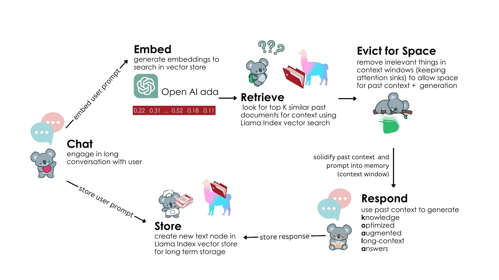

# Knowledged Optimized Augmentation for Long-context Access (KOALA)

6.5940 Final Project

Kavya Anbarasu, Gilford Ting, Sarah Wang, Jessica Xu, and Joyce Yuan

[[(need to update link)paper](http://arxiv.org/abs/2309.17453)] [[poster](https://github.com/joyce-yuan/koala/blob/main/figures/Tiny%20ML%20Poster%20Presentation.png)][[video demo](https://drive.google.com/file/d/10lyi-p_39HN0g5TMKyX2wNc5KysVcC3G/view?fbclid=IwZXh0bgNhZW0CMTEAAR3izV2UGjB7AeYXVD5XnRxa-TukgJGQDf8n00XkgoThDwJhXSfVAisvpWE_aem_TlXJ5Dalw_TqrzxnwFqWzA)]

 
## TL;DR

By integrating StreamingLLM with Retrieval-Augmented Generation (RAG), we can dynamically retrieve and use relevant context that would otherwise have been evicted from the cache to allow for infinite-length inputs without sacrificing performance.

## Diagram


## Abstract

Large language models (LLMs) have made significant advancements, yet they remain constrained by a finite attention window, limiting their ability to process information beyond a fixed sequence length. Efficient Streaming Language Models with Attention Sinks (StreamingLLM) partially addresses this by enabling LLMs to generalize to infinite sequence lengths without fine-tuning. However, StreamingLLM cannot access tokens that have been evicted from its cache and loses previous context. To overcome this limitation, we propose deploying StreamingLLM with Retrieval-Augmented Generation (RAG) to create Knowledge Optimized Augmentation for Long-context Access (KOALA). This hybrid approach enables dynamic retrieval of previously evicted tokens to effectively simulate "infinite memory" by reintroducing relevant information back into the model’s attention span as needed. KOALA demonstrates improved results for Needle in Haystack evaluation as well as decreased perplexity compared to StreamingLLM. This solution holds promise for LLM applications requiring sustained, contextually aware responses in real-time, long-context tasks. 
## Usage

  

### Environment Setup

  

```bash

conda create -yn streaming python=3.8

conda activate streaming

  

pip install torch torchvision torchaudio

pip install transformers==4.33.0 accelerate datasets evaluate wandb scikit-learn scipy sentencepiece

pip install llama-index

  

python setup.py develop

```

### OpenAI Key
An OpenAI Key is needed for LlamaIndex. It can be set in your `~/.bashrc` or by running

```bash

export OPENAI_API_KEY = "{key}"  

```

### Run Demo Chatbot

  

```bash

python examples/koala_demo.py

```


### Run Needle in Haystack Evaluation

  

```bash

python examples/eval_haystack.py

```
  

### Run Perplexity Evaluation

  
For the KOALA cache:
```bash

python examples/koala_eval_ppl.py --num_eval_tokens 1000

```

For the original cache to compare:
```bash

python examples/original_eval_ppl.py --num_eval_tokens 1000

```

Note: You can preface each Python script with `CUDA_VISIBLE_DEVICES=0` to specify a desired gpu to suit your purposes
  

## Acknowledgements

  Thank you to the 6.5940 staff for all your support and a great semester!

## Citation

  

Our project was based off the following paper for StreamingLLM

  

```bibtex

@article{xiao2023streamingllm,
        title={Efficient Streaming Language Models with Attention Sinks},
        author={Xiao, Guangxuan and Tian, Yuandong and Chen, Beidi and Han, Song and Lewis, Mike},
        journal={arXiv},
        year={2023}
        }

```


